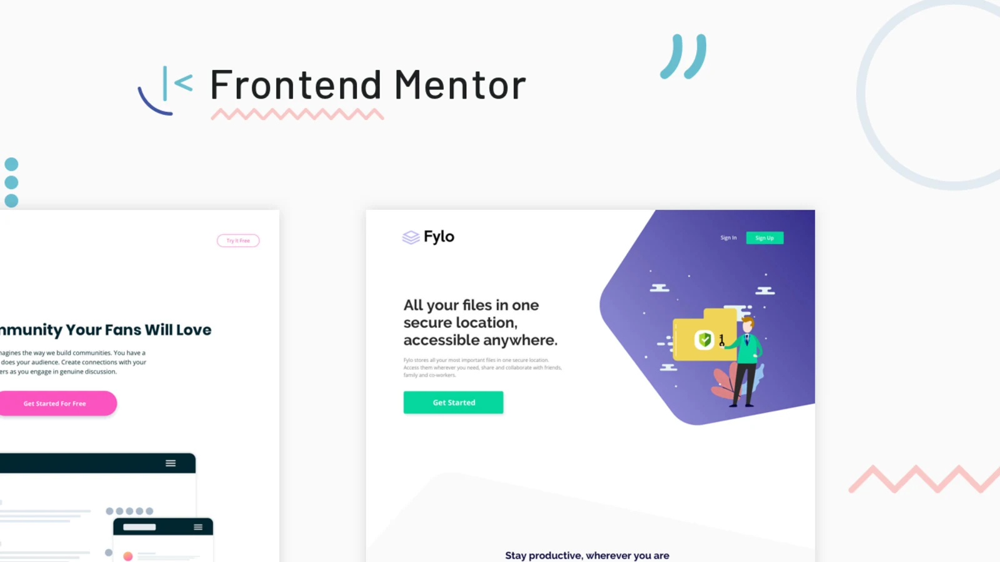

#  Frontend Mentor - Frontend Coding Challenges :)

Welcome to my GitHub! Explore my web development projects, YouTube tutorials, and Frontend Mentor solutions. I'm here to help you boost your skills with hands-on practice.

## 🌐 Visit My Website

Explore more about my work, projects, and tutorials on my personal website:

- **[Visit Website](https://iam-azhaar.github.io/frontend-mentor/)**

## 🚀 Projects

### Frontend Mentor Challenges

I work on Frontend Mentor challenges to practice front-end skills and build real-world projects, focusing on clean, responsive code.

- **[Frontend Mentor Profile](https://www.frontendmentor.io/profile/iam-azhaar)** - View the challenges I've completed and follow my progress.

## 🛠️ Technologies Used

- HTML5
- CSS3
- JavaScript

# 