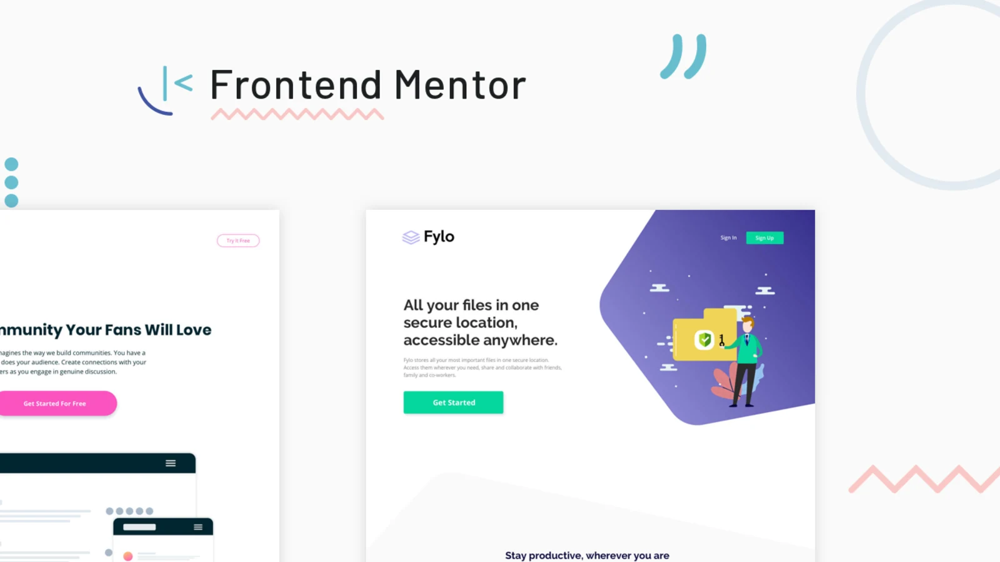

#  Frontend Mentor - Frontend Coding Exercises :)

This repository contains projects I’m working on from [Frontend Mentor](https://www.frontendmentor.io/challenges).

Check out my frontend mentor profile [here](https://www.frontendmentor.io/profile/iam-azhaar).

**Since I’m not a PRO member on Frontend Mentor, I don’t have the design files, so sizes might not be exact. Thanks for understanding!**

# 

## Author

Muhammad Azhar 👨‍💻

- GitHub - [@iam-azhaar](https://github.com/iam-azhaar)
- Frontend Mentor - [@iam-azhaar](https://www.frontendmentor.io/profile/iam-azhaar)